# Real-Time Fraud Detection System ⚙️

A production-style real-time fraud detection pipeline using **Kafka**, **FastAPI**, **XGBoost/CatBoost/LightGBM**, **Prometheus**, and **Grafana**.

This project simulates real-time credit card transactions and detects fraudulent activity using trained ML models, exposing inference metrics for live monitoring.

---

## Key Features

- **Real-Time Streaming** via Kafka (with Zookeeper)
- **Machine Learning Inference** with FastAPI + pre-trained models
- **Metrics + Monitoring** using Prometheus + Grafana
- **Feature Engineering** and preprocessing using pipelines
- **Dockerized Deployment** via `docker-compose`

---

## Architecture Overview

```mermaid
%%{init: {'theme': 'forest', 'themeVariables': { 'fontSize': '30px', 'fontFamily': 'sans-serif'}}}%%
flowchart LR
  Simulator["✉️ <br>data_simulator.py<br>Simulated Transactions"]
  Kafka["📥 <br>Kafka Broker"]
  Consumer["📝<br>consumer.py<br>Kafka Consumer"]
  FastAPI["🧠<br>inference.py<br>(/predict)<br>ML Inference"]
  Prometheus["🧮 <br>Prometheus<br>/metrics scraping"]
  Grafana["📊 <br>Grafana Dashboards"]

  Simulator --> Kafka
  Kafka --> Consumer
  Consumer --> FastAPI
  FastAPI --> Prometheus
  Prometheus --> Grafana
```

## Tech Stack

| Domain             | Technology / Tool                                                                 |
|--------------------|------------------------------------------------------------------------------------|
| **Language**       | [Python 3.12](https://www.python.org/downloads/release/python-3120/)              |
| **Web API**        | [FastAPI](https://fastapi.tiangolo.com/)                                          |
| **Machine Learning** | [XGBoost](https://xgboost.ai/), [LightGBM](https://lightgbm.readthedocs.io/), [CatBoost](https://catboost.ai/) |
| **Preprocessing**  | [Scikit-learn Pipelines](https://scikit-learn.org/stable/modules/compose.html), Custom [Feature Engineering](https://en.wikipedia.org/wiki/Feature_engineering) |
| **Streaming**      | [Apache Kafka](https://kafka.apache.org/), [Zookeeper](https://zookeeper.apache.org/) |
| **Metrics**        | [prometheus_client](https://github.com/prometheus/client_python)                  |
| **Monitoring**     | [Prometheus](https://prometheus.io/), [Grafana](https://grafana.com/)             |
| **Containerization** | [Docker](https://www.docker.com/), [Docker Compose](https://docs.docker.com/compose/) |
| **Data Source**    | [IEEE-CIS Fraud Detection Dataset](https://www.kaggle.com/competitions/ieee-fraud-detection) |

## Running the Project

### 1. Clone the repository  
`git clone https://github.com/your-username/real-time-fraud-detection.git`  
`cd real-time-fraud-detection`  

### 2. Data Directory

For detailed instructions on preparing the raw dataset, see the [data/README.md](data/README.md) file.

### 3. Install dependencies  
`python -m venv .venv`  
`source .venv/bin/activate` or `.venv\Scripts\activate` on Windows   
`pip install -r requirements.txt`  

### 4. Start core services  
`docker compose up -d`  
This spins up:  
- zookeeper  
- kafka  
- prometheus  
- grafana  
- fastapi (serving the /predict and /metrics endpoints)  
### 5. Run the Kafka consumer  
`python -m src.inference.consumer`  
### 6. Run the data simulator  
`python -m src.data_simulator.data_simulator`  

### 7. Open Grafana and Prometheus dashboards

- Grafana: [http://localhost:3000](http://localhost:3000)
  - log in (admin / admin), click "Dashboards" → "New" → "Import", then upload grafana/dashboards/Fraud-Metrics.json file. 
- Prometheus: [http://localhost:9090](http://localhost:9090)
- FastAPI API: [http://localhost:8000](http://localhost:8000)
- Metrics endpoint: [http://localhost:8000/metrics](http://localhost:8000/metrics)

Note: To use another model (e.g. LightGBM, CatBoost, XGBoost), set the MODEL_NAME environment variable in docker-compose.yml

## Future Enhancements  
- Add Kafka message persistence
- CI/CD with GitHub Actions
- REST API auth layer (JWT / API Key)
- Model versioning support
## License
MIT — free to use and modify.
